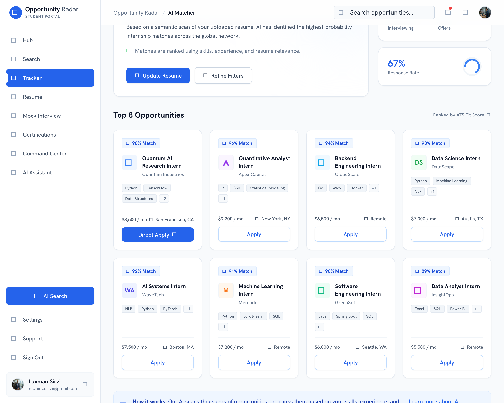
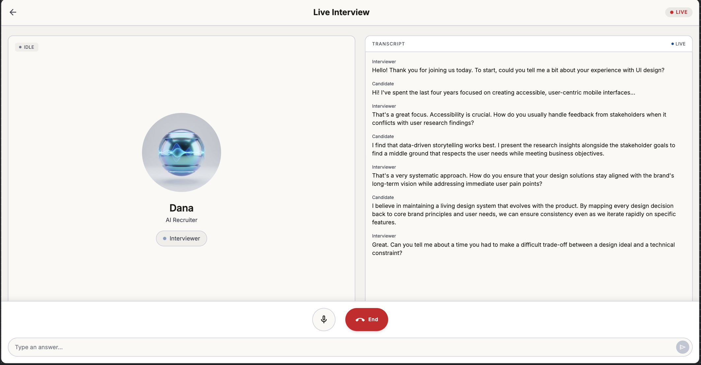
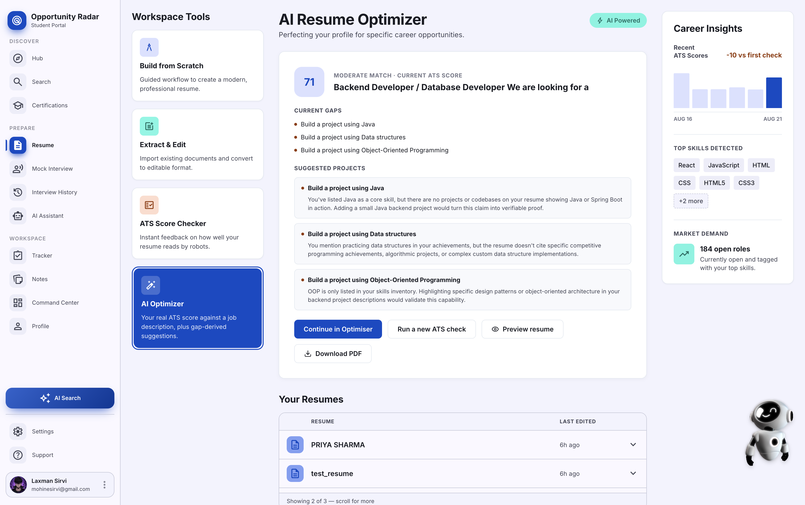
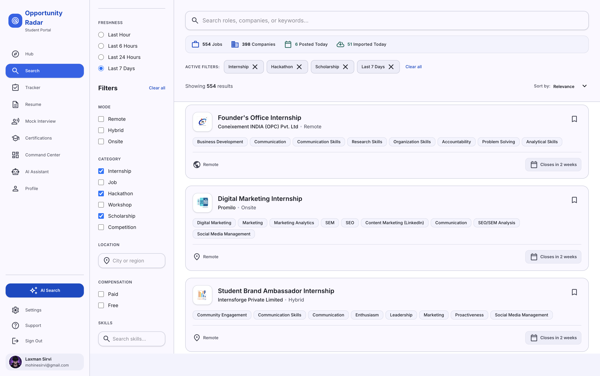
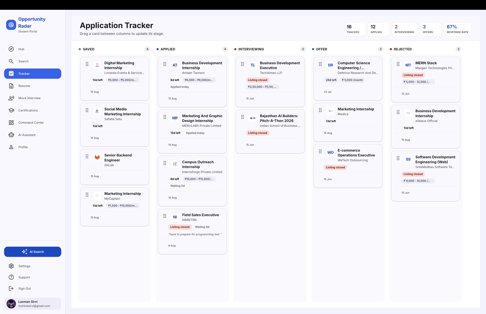
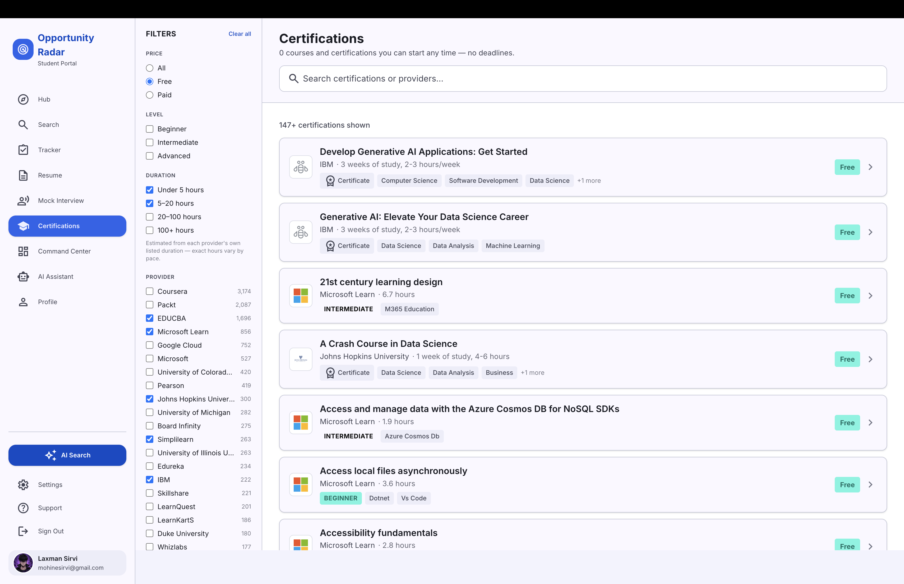
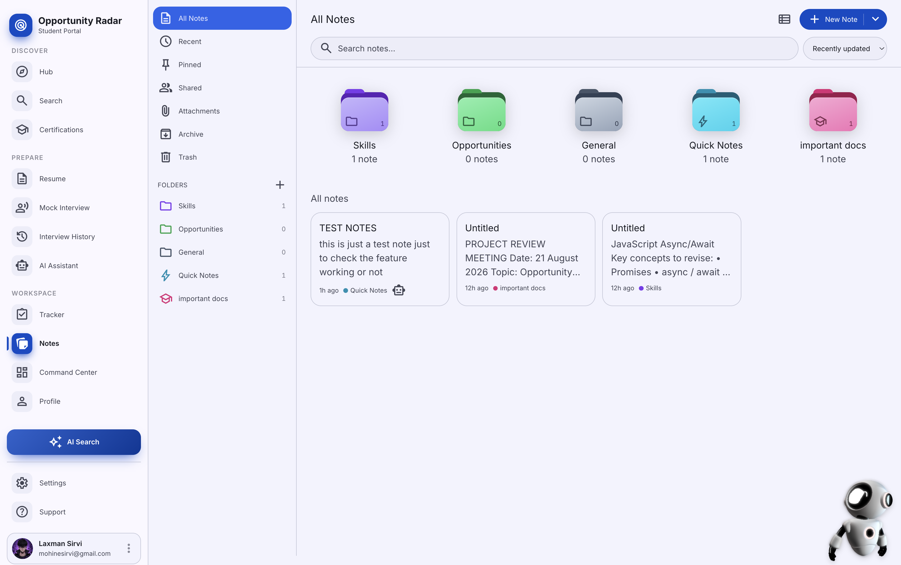
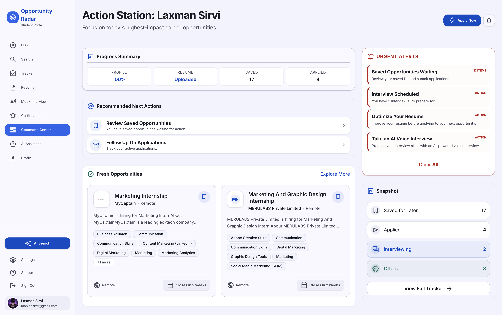
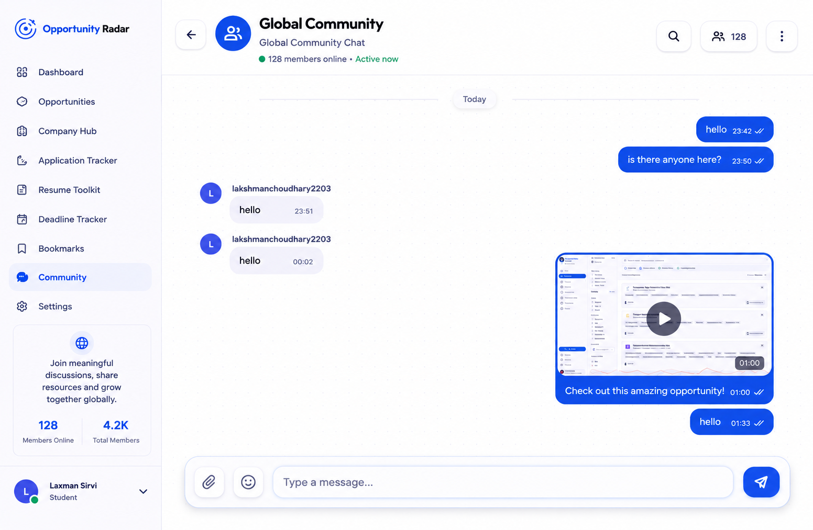

<div align="center">

# 🚀 Opportunity Radar

### A student should never miss an opportunity.

Opportunity Radar is a full-stack, AI-powered platform that helps students **discover, apply to, and prepare for** internships and early-career roles — internships, jobs, hackathons, scholarships, open-source programs and more — from many sources, in one place.

It goes beyond aggregation: an **agentic AI Search** matches openings to your résumé, a real-time **voice Mock Interview** rehearses you and scores you out of 100, a **résumé toolkit** builds and ATS-checks your CV, and 20,000+ **certifications** help you close skill gaps.

[](https://nextjs.org/)
[](https://www.typescriptlang.org/)
[](https://supabase.com/)
[](https://tailwindcss.com/)
[](https://opportunity-radar-six.vercel.app)
[](#-license)

**[Live Demo](https://opportunity-radar-six.vercel.app)** · [Features](#-features) · [Architecture](#️-architecture) · [Getting Started](#-getting-started) · [Author](#-author)

</div>

---



---

## 📌 The problem

Opportunities are scattered across dozens of platforms — Internshala, Unstop, Amazon Jobs, Devfolio, Outreachy, GSoC, Y Combinator, Greenhouse, LFX, Hack2Skill — and checking each one every day is slow, repetitive, and error-prone. Students miss deadlines simply because the information never reached them in time.

**Opportunity Radar solves this** by aggregating opportunities from trusted sources into one searchable platform, then layering AI on top to match, prepare, and apply.

---

## ✨ Features

Opportunity Radar is a complete student career platform — 31 pages and 50+ API routes. The headline pieces:

### 🤖 AI Search — résumé → matched internships
Upload a résumé and an agentic pipeline runs a multi-source web search, extracts real postings (never listing pages), scores each against your skills and experience, and returns a ranked, geographically-tiered list — **every result carries a working apply link**. Powered by a dedicated agent backend ([`opportunity-radar-ai-agent`](https://github.com/Laxmansirvi05/opportunity-radar-ai-agent)).

### 🎙️ Voice Mock Interview
A real-time, voice-first mock interview with an AI recruiter — live speech-to-text, streaming captions, and a natural back-and-forth — followed by a **/100 score, model answers, and a saved report you can revisit**. Built on LiveKit with Deepgram STT, Gemini, and self-hosted Kokoro TTS.



### 📄 Résumé Toolkit
Build a résumé from scratch, import an existing one, run an **ATS check**, and get **AI optimisation** suggestions — an integrated, template-driven builder with live PDF export.



### 🔎 Smart Opportunity Search
Full-text PostgreSQL search across thousands of live opportunities with RPC optimisation and a rich filter rail — source, category, skills, location, remote, and company.



### 📊 Application Tracker
A Kanban board (drag-and-drop across Interested → Applied → Interview → Offer → Rejected) with optimistic updates, per-application notes, bookmark sync, and a live response-rate stat.



### 🎓 Certifications Library
**20,000+ certifications** from 138 providers — every one with a working URL and logo — with price, level, duration and provider filters, GIN-indexed full-text search, infinite scroll, and a weekly refresh + daily dead-link sweep.



### 🧠 AI Assistant
A grounded chat assistant that answers questions about your opportunities and applications — with an anti-fabrication guard that says "nothing matched" rather than inventing listings.

### 📝 Notes
A full notes workspace — folders, tags, pin/archive/trash, search, a rich editor, and public sharing.



### 💬 Global Community Chat & Command Center
A real-time community chat plus a personalised **Command Center** dashboard summarising your activity, deadlines, and next actions.

<p align="center">
  
  
</p>

### 🔐 Authentication
Secure Supabase Auth with email and Google sign-in, double-gated route protection (optimistic proxy + authoritative server layout), open-redirect-safe `?next=` handling, and server-side credential validation.

---

## 🌐 Integrated sources

| Source | Type |
| --- | --- |
| Amazon | Jobs |
| Internshala | Internships |
| Unstop | Competitions & Jobs |
| Devfolio | Hackathons |
| Outreachy | Open-source programs |
| GSoC | Open-source programs |
| Greenhouse | Jobs |
| LFX | Open-source programs |
| Hack2Skill | Hackathons |
| Y Combinator | Startup opportunities |

---

## 🏗️ Architecture

Opportunity Radar is a Next.js app backed by Supabase, with **two dedicated AI agent backends** running on Azure.

```
                          ┌─────────────────────────────┐
                          │   Next.js app (Vercel)       │
   Student ──browser────▶ │  31 pages · 50+ API routes   │
                          │  SSR · RSC · Tailwind        │
                          └──────┬───────────────┬───────┘
                                 │               │
                 ┌───────────────▼──┐      ┌─────▼──────────────────┐
                 │  Supabase        │      │  AI agent backends     │
                 │  Postgres + Auth │      │  (Azure VM)            │
                 │  RLS on all      │      │  • AI Search agent     │
                 │  tables · FTS    │      │  • Voice Interview     │
                 └──────────────────┘      │    agent + LiveKit     │
                                           └────────────────────────┘
        ┌────────────────────────────────────────────┐
        │  Ingestion pipeline (cron)                  │
        │  Provider → extract → normalize → validate  │
        │  → skill-extract → dedup → bulk upsert → DB │
        └────────────────────────────────────────────┘
```

| Layer | Stack |
| --- | --- |
| **Frontend** | Next.js 15 (App Router, RSC), TypeScript (strict), Tailwind CSS |
| **Backend** | Supabase (PostgreSQL + Auth), serverless API routes |
| **AI Search** | Agentic pipeline ([separate repo](https://github.com/Laxmansirvi05/opportunity-radar-ai-agent)) — n8n + Node services + Tavily |
| **Voice Interview** | LiveKit · Deepgram (STT) · Gemini (LLM) · Kokoro (TTS) |
| **Hosting** | Vercel (web) · Azure VM (agents) · Supabase Cloud (data) |
| **Testing** | Vitest (unit) · Playwright (e2e) — 590+ tests passing |

### Ingestion & bulk upsert

Ingestion was redesigned from sequential inserts to **batched bulk upserts** with database-level dedup constraints:

| Records | Old (sequential) | New (bulk upsert) |
| --- | --- | --- |
| 100 | ~2.3 min | ~1.8 sec |
| 500 | ~11.6 min | ~4.4 sec |
| 1,000 | ~23.3 min | ~8.6 sec |

**~160× faster**, with 0 duplicates and 0 missing apply URLs in production.

---

## 🛡️ Security

- **Row-Level Security on every table**, with per-user ownership policies on all user-data tables.
- `SECURITY DEFINER` functions locked down and `search_path` pinned.
- Protected cron routes with secret validation; no hardcoded secrets (everything reads `process.env`).
- Server-side input validation and open-redirect-safe auth redirects.

---

## 🚀 Getting Started

> The app lives in [`frontend/`](frontend). It targets **Next.js 15 / Node 20+**.

```bash
# 1. Clone
git clone https://github.com/Laxmansirvi05/opportunity-radar.git
cd opportunity-radar/frontend

# 2. Install
npm install

# 3. Configure — copy the example and fill in your keys
cp .env.example .env.local
#   Required: NEXT_PUBLIC_SUPABASE_URL, NEXT_PUBLIC_SUPABASE_ANON_KEY,
#             SUPABASE_SERVICE_ROLE_KEY, and the AI agent endpoints/secrets

# 4. Run
npm run dev            # http://localhost:3000
```

Useful scripts:

```bash
npm run build          # production build
npm run type-check     # tsc --noEmit (project is type-clean)
npm run test           # vitest
npm run lint           # eslint
```

The AI Search agent backend has its own setup — see
[`opportunity-radar-ai-agent`](https://github.com/Laxmansirvi05/opportunity-radar-ai-agent).

---

## 📈 Production snapshot

- **4,700+** live opportunities · **0** duplicates · **0** missing apply URLs
- **20,000+** certifications across 138 providers
- **10** active ingestion sources with weekly refresh + daily link-sweep
- **590+** automated tests passing · TypeScript-clean

---

## 🧭 Repository layout

| Path | What |
| --- | --- |
| `frontend/` | The Next.js application (pages, API routes, features, tests) |
| `frontend/features/` | Feature modules — résumé toolkit, command palette, etc. |
| `supabase/` | Database migrations and configuration |
| `docs/` | Architecture, PRD, security plan, audits, integration guides |
| `designs/` | Screen designs and UI reference |

---

## 🗺️ Roadmap

- Personalised AI opportunity recommendations from activity history
- Smart deadline & matching-role notifications
- Native mobile apps (Android / iOS)
- An analytics dashboard for application insights

---

## 👨‍💻 Author

**Laxman Sirvi** — [@Laxmansirvi05](https://github.com/Laxmansirvi05)

Opportunity Radar was built to help students discover opportunities faster and eliminate the problem of scattered information across dozens of platforms.

---

## 📜 License

Released for **educational and portfolio** purposes.

---

<div align="center">

⭐ **If this project helped you, consider starring the repo.**

</div>
